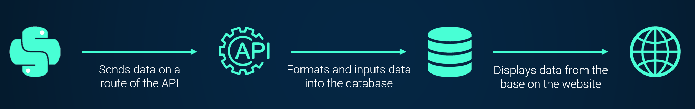
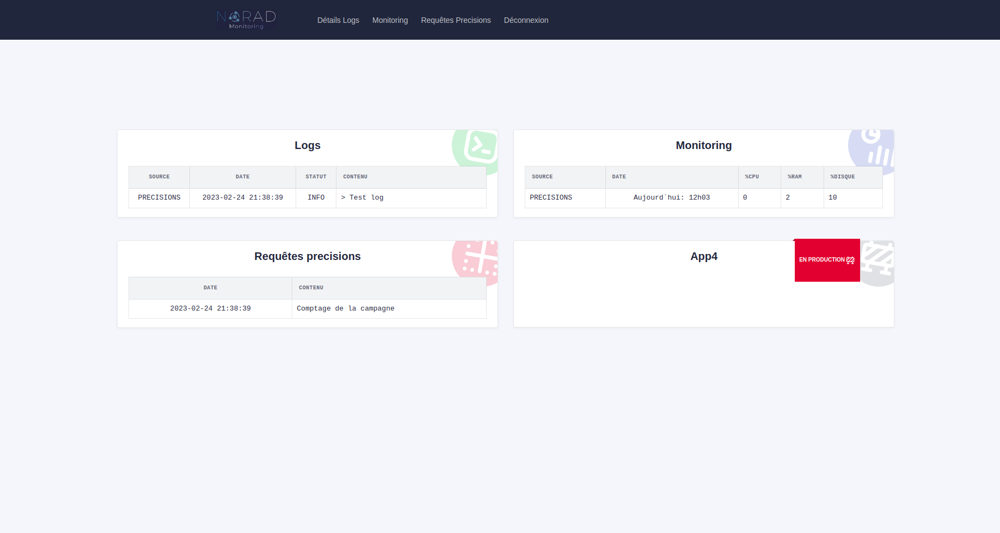
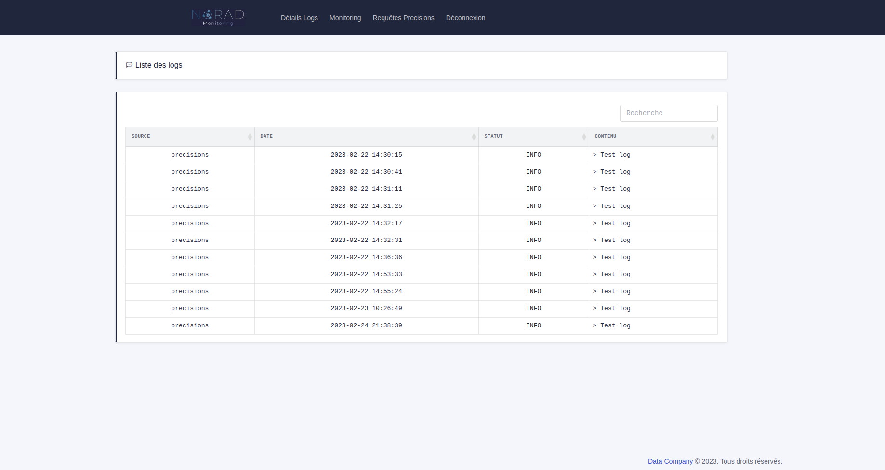
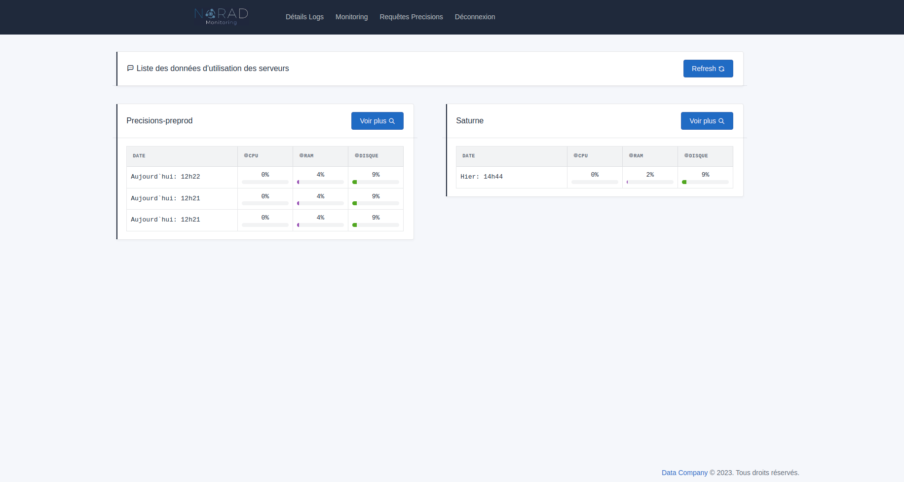
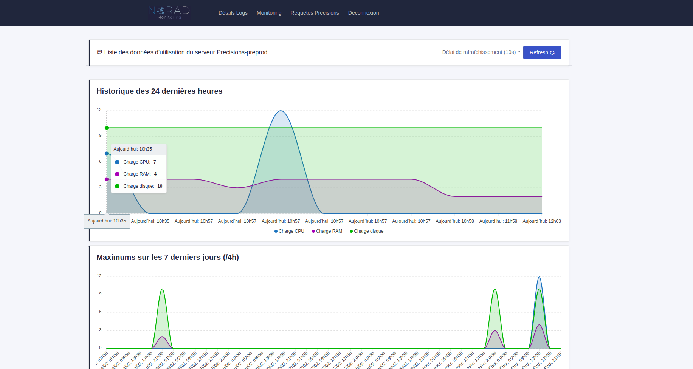
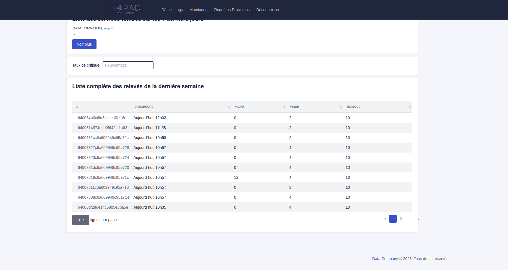
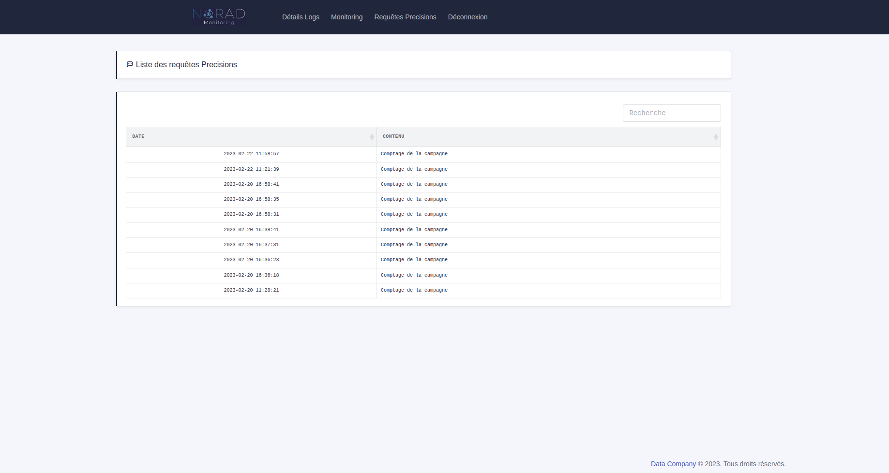

# NORAD

## Description
This project is a monitoring app I worked on during my 2nd BTS year internship. It is a web application that centralizes the activity of the information system of the company. It is an app which includes log well, a server load monitoring, and a list of the executed requests on the servers applications.
The project comes with a Python library to deploy on the networked servers, an API which collects data and register them in a database, and a responsive website for the dev team to monitor the servers state.

## Flows

## Stack
- API: Flask
- Website: Django, HTML/CSS, JS
- Database: MongoDB

## Screens
### Homepage

### Log well

### Monitoring

### Requests

